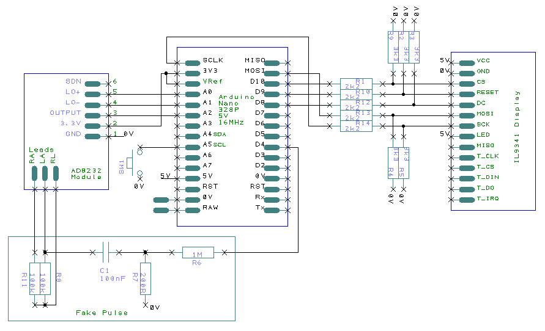

The display used is 320 x 240 pixel As driver the library used in Simple ILI9341.h and Simple ILI9341.ccp both files are in the project.
All libraries used in this project are included in the project.

Pin wiring

The table below shows the 1.8 TFT wiring to Arduino UNO.

|2.8 TFT Display |    |Wiring to Arduino Uno|
| :-------------:|:--:|:--------------------|
|LED	           | => |   3.3 V             |
|SCK             | => |	  Pin 13            |
|SDA (MOSI)      | => |   Pin 11 (MOSI)     |
|DC              | => |   Pin 8	            |
|TFT RESET       | => |   Pin	9             |
|CS	             | => |   Pin 10            |
|GND	           | => |   GND               |
|VCC	           | => |   5 V               |

|SD card on TFT display	|      |Wiring to Arduino Uno  |
| :--------------------:|:----:|:---------------------:|
|CS                     |  =>  |    4                  |
|MOSI                   |  =>  |    11                 |
|MISO                   |  =>  |    12                 |
|SCK                    |  =>  |    13                 |

|Board Label	|   Pin Function      |  Wiring to Arduino Uno  |
| :----------:|:-------------------:|:---------------------:|
|GND          | Ground              |    GND                |
|3.3V         | Power suply         |    3.3V               |
|Output       | Output signal       |    A1                 |
|LO -         | Leads off - Detect  |    6                  |
|LO +         | Leads off + Detect  |    5                  |

PIN 

